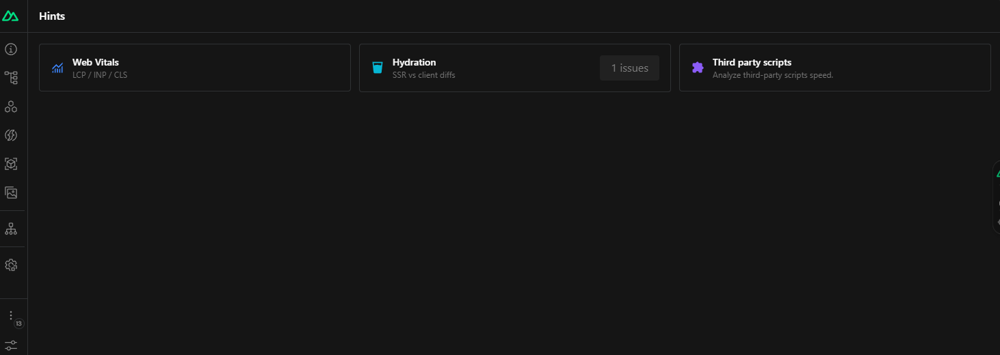
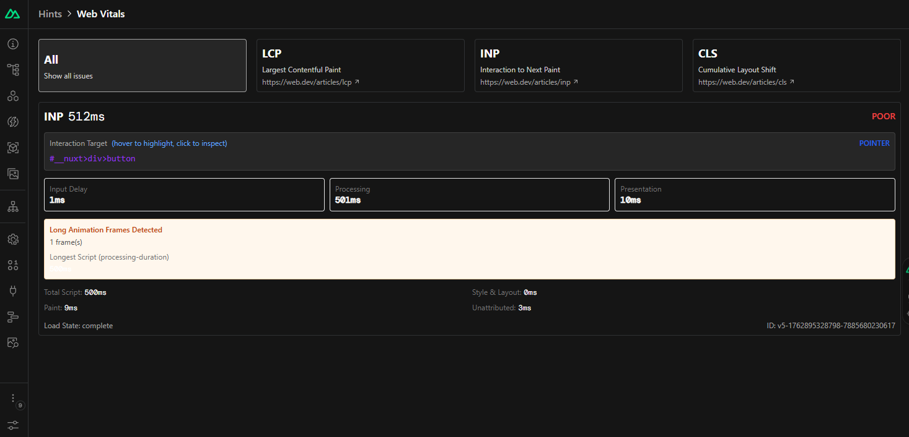
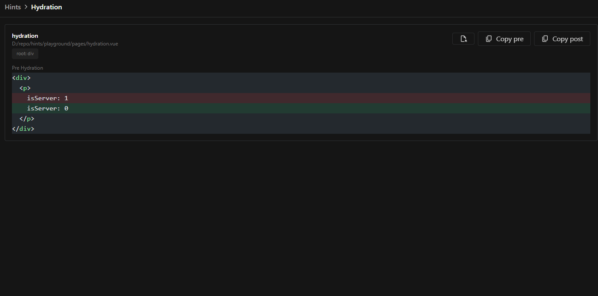
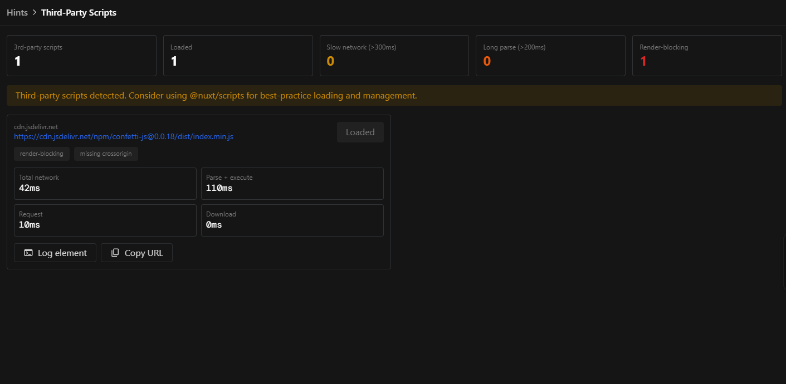

# Nuxt Hints

[![npm version][npm-version-src]][npm-version-href]
[![npm downloads][npm-downloads-src]][npm-downloads-href]
[![License][license-src]][license-href]
[![Nuxt][nuxt-src]][nuxt-href]

**A Nuxt module that provides real-time feedback on your application's performance, accessibility, and security right in your browser.**

Nuxt Hints integrates directly into the Nuxt DevTools, giving you actionable insights to improve your web vitals, fix hydration mismatches, and audit third-party scripts without ever leaving your development environment.

- [✨Release Notes](/CHANGELOG.md)

## Getting Started

To install and add the module, you can run the following command:

```bash
npx nuxt module add hints
```

The module is now automatically installed and added to your `nuxt.config.ts`.
Now you can open your Nuxt app, go to the DevTools, and click the Nuxt Hints icon to get started.

## Features

- **🚀 Rich DevTools UI**: A dedicated tab in Nuxt DevTools to visualize issues, inspect elements, and get recommendations.
- **💧 Hydration Mismatch Debugging**: Side-by-side diffing of server-rendered and client-hydrated HTML to pinpoint the exact cause of mismatches.
- **⚡️ Web Vitals Analysis**: Real-time metrics for LCP, INP, and CLS with detailed attribution and element-specific optimization tips.
- **📦 Third-Party Script Auditing**: Dashboard to monitor performance, identify render-blocking scripts, and get security recommendations.
- **🔍 Interactive Diagnostics**:
  - **Hover to Highlight**: Hover over an issue in the DevTools to highlight the corresponding element on your page.
  - **Click to Inspect**: Click to open the component source file directly in your code editor.
- **💡 Actionable Console Warnings**: Clear, concise console messages that guide you to best practices and performance improvements.

## Visual Interface within Devtools

Nuxt Hints provides a rich, interactive UI inside the Nuxt DevTools panel.

### Homepage

A central hub to see a summary of all detected issues at a glance.



### Web Vitals

Drill down into Core Web Vitals metrics. See detailed attribution for LCP, INP, and CLS, inspect the problematic elements, and get context-aware advice.



### Hydration Inspector

Debug hydration mismatches with a powerful side-by-side diff viewer. See the exact differences between the server-rendered HTML and the client-side result.



### Third-Party Scripts

Analyze all third-party scripts on your page. The dashboard shows loading times, render-blocking status, and security attributes, helping you identify and mitigate performance bottlenecks.



## How It Works

### Performance Monitoring

Nuxt Hints uses `web-vitals` to gather Core Web Vitals metrics and automatically logs any msetrics that need improvement. It listens for INP, LCP, and CLS and provides detailed attribution for each.

### Hydration Mismatch Detection

The module hooks into Vue's hydration process to compare the server-rendered DOM with the client-side DOM. When a mismatch is detected, it captures the pre- and post-hydration HTML for inspection.

### Third-Party Script Analysis

Using a combination of a Nitro plugin and client-side observers, Nuxt Hints tracks every script loaded on the page, measuring its performance and analyzing its attributes.

### Example Console Output

When Nuxt Hints detects issues, you'll see clear warnings in your browser console:

```
[@nuxt/hints:performance] LCP Element should not have `loading="lazy"`
Learn more: https://web.dev/optimize-lcp/#optimize-the-priority-the-resource-is-given
```

```
[@nuxt/hints] Third-party script "https://cdn.example.com/script.js" is missing crossorigin attribute.
Consider adding crossorigin="anonymous" for better security and error reporting.
```

## Development

```bash
# Install dependencies
pnpm install

# Generate type stubs
pnpm run dev:prepare

# Develop with the playground
pnpm run dev

# Build the playground
pnpm run dev:build

# Run ESLint
pnpm run lint

# Run Vitest
pnpm run test
pnpm run test:watch

# Release new version
pnpm run release
```

<!-- Badges -->

[npm-version-src]: https://img.shields.io/npm/v/@nuxt/hints/latest.svg?style=flat&colorA=18181B&colorB=28CF8D
[npm-version-href]: https://npmjs.com/package/@nuxt/hints
[npm-downloads-src]: https://img.shields.io/npm/dm/@nuxt/hints.svg?style=flat&colorA=18181B&colorB=28CF8D
[npm-downloads-href]: https://npmjs.com/package/@nuxt/hints
[license-src]: https://img.shields.io/npm/l/@nuxt/hints.svg?style=flat&colorA=18181B&colorB=28CF8D
[license-href]: https://npmjs.com/package/@nuxt/hints
[nuxt-src]: https://img.shields.io/badge/Nuxt-18181B?logo=nuxt
[nuxt-href]: https://nuxt.com
